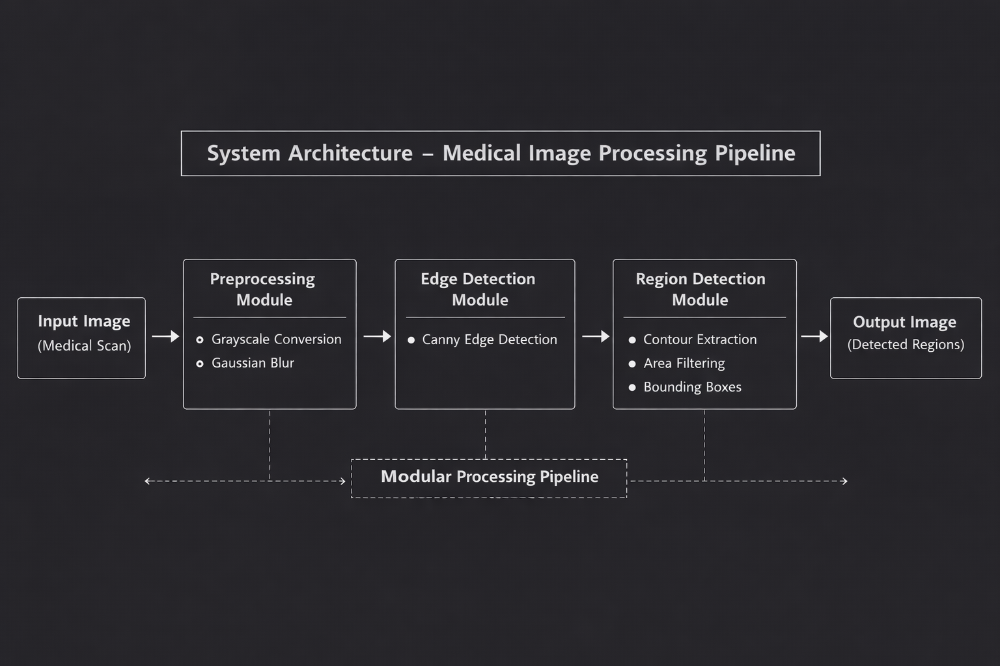

# Medical Image Processing System

A modular **medical image processing pipeline built in C++ using OpenCV** that analyzes diagnostic images, enhances image quality, detects structural edges, and highlights significant regions using contour based analysis. The project models the **core preprocessing and analysis stages used in medical imaging pipelines**, where diagnostic scans are processed to improve visibility and identify potential regions of interest.


## Overview

This project implements a **medical image processing tool** that performs automated analysis of diagnostic images such as X-rays or CT scans. The system processes images through a sequence of computer vision operations including noise filtering, contrast enhancement, edge detection, and contour based region detection.

The goal of the project is to demonstrate how **classical computer vision algorithms can be combined into a structured image analysis pipeline** similar to the preprocessing stages used in medical imaging software.

The system is built to showcase **modern C++ system design principles**, including modular architecture, batch image processing pipelines, performance measurement, and integration of external libraries such as OpenCV.


## Features

- **Noise Filtering Pipeline** - Applies Gaussian blur to reduce sensor noise and improve image quality prior to further analysis.
- **Contrast Enhancement** - Uses histogram equalization to improve visibility of structural features in diagnostic images.
- **Edge Detection Engine** - Implements the Canny edge detection algorithm to identify boundaries of anatomical structures.
- **Contour-Based Region Detection** - Extracts contours from detected edges and filters regions based on area to identify significant structures.
- **Batch Image Processing** - Automatically processes multiple medical images from an input directory.
- **Performance Benchmarking** - Measures execution time for each stage of the processing pipeline.
- **Modular System Architecture** - Organized into independent components (`preprocessing`, `edge_detection`, `region_detection`) to maintain separation of responsibilities.


## Tech Stack

| Component | Technology |
|--------|--------|
| Language | C++17 |
| Image Processing Library | OpenCV |
| Compiler | g++ (MinGW / GCC) |
| Standard Libraries | `<iostream>`, `<filesystem>`, `<chrono>` |
| Build Tool | g++ CLI |
| Version Control | Git + GitHub |


## Architecture

The system follows a **modular processing pipeline where each stage performs a specific image analysis task**.




## How It Works

1. The **image loader** reads medical images from the input directory.
2. The **preprocessing module** converts images to grayscale, applies noise reduction, and enhances contrast.
3. The **edge detection module** detects structural edges using the Canny algorithm.
4. The **region detection module** extracts contours from detected edges and filters significant regions.
5. The system highlights detected regions with bounding boxes and saves processed images to the results directory.

This pipeline mimics the **image preprocessing workflow used in diagnostic imaging systems**.


## Systems Concepts Demonstrated

- **Modular C++ System Design** - Implemented separate modules for preprocessing, edge detection, and region analysis to maintain clean system architecture.
- **Computer Vision Processing Pipeline** - Built a multi-stage image processing workflow combining filtering, enhancement, edge detection, and region extraction.
- **Batch Data Processing** - Designed the system to process multiple input images automatically using directory iteration.
- **Performance Measurement** - Used `std::chrono` to measure execution time for each processing stage.


## Build & Run

```bash
# Clone repository
git clone https://github.com/Vidhisahay/Medical-Image-Processing-System.git
cd Medical-Image-Processing-System

# Compile
g++ -std=c++17 src/main.cpp src/preprocessing.cpp src/edge_detection.cpp src/region_detection.cpp -Iinclude -o medical_app `pkg-config --cflags --libs opencv4`

# Run
./medical_app
```

The program processes all images inside the `images` directory and saves processed results to the `results` directory.


## Future Improvements

Potential extensions for the system include:

- **Advanced Image Segmentation** - Implement morphological operations and threshold based segmentation techniques.
- **DICOM Image Support** - Add support for medical imaging formats commonly used in radiology systems.
- **Machine Learning Integration** - Integrate trained models for automated abnormality detection.
- **Visualization Interface** - Build a graphical dashboard for interactive visualization of processed scans.
- **Parallel Processing Pipeline** - Introduce multi-threaded processing to improve performance when handling large datasets.


## Acknowledgements

Thanks to the open-source C++ and OpenCV communities whose documentation and examples helped guide the implementation of the image processing pipeline ❤️